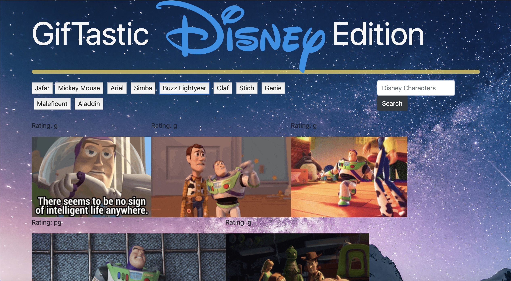

# GifTastic Disney Edition

The GifTastic App (Disney Edition), allows you to view fun gifs of your favorite Disney characters from GIPHY.

HOW TO USE APP:
1. Click one of the given Disney character buttons to display GIFs of that character. You can animate the GIFs by clicking on them. The content ratings will also be displayed next to each GIF.

2. On the seach bar, you can type in another Disney character's name which will create a new button for that character after you click on the search button. Click on this new button and the GIFs of this character will be displayed. 

Technology Used:
This project was built with JavaScript, jQuery, Bootstrap, HTML, and CSS. 
The images displayed are retrieved from the GIPHY API.

Click the link for the live demo:
https://madg1992.github.io/GifTastic/
